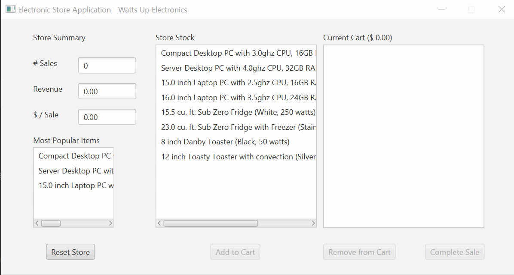

# Electronic Store

This application emulates an Electronic Store. It uses the JavaFX framework for the UI. The application is built using the Model View Controller design pattern with the principles of Encapsulation, Abstraction, Inheritance and Polymorphism.

